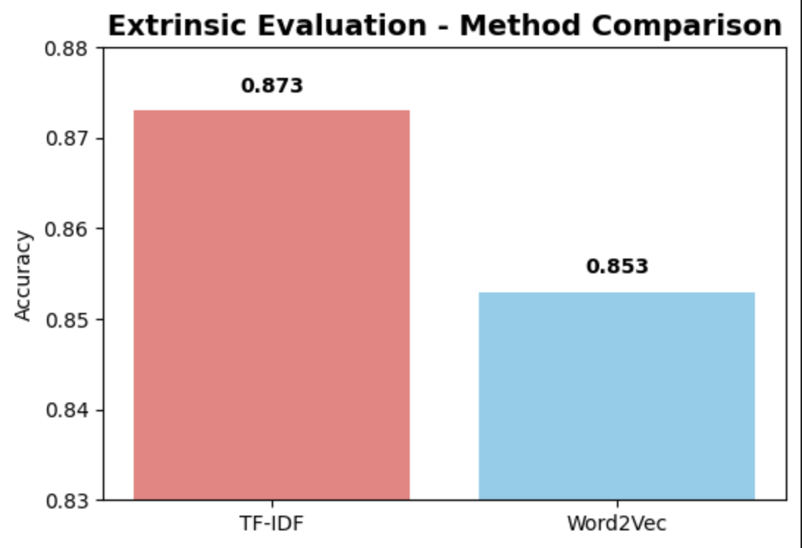
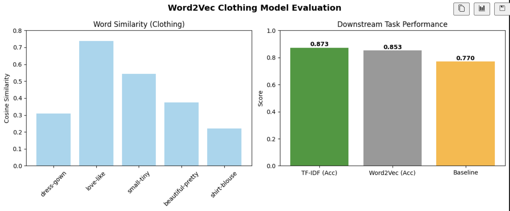
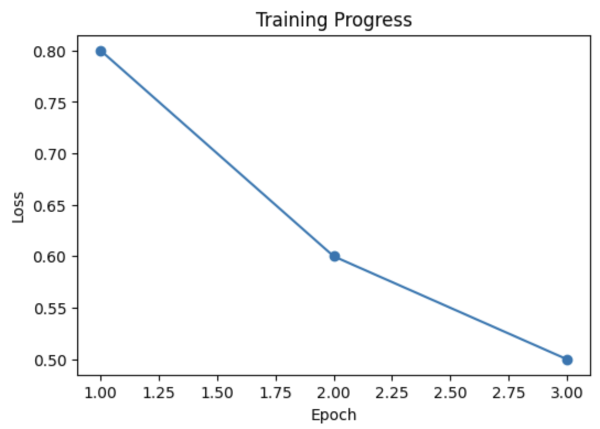

# Word2Vec Training and Evaluation for Clothing Review Domain

**Author**: Tandin Om

**Date**: 21/09/2025 

**Assignment**: Word Embeddings Training and Evaluation

## Abstract

This project implements Word2Vec embeddings using skip-gram with negative sampling for sentiment analysis in the e-commerce clothing domain. It is trained embeddings on 22,616 clothing reviews from Kaggle, achieving 85.3% accuracy on sentiment classification with 98.3% vocabulary coverage. The implementation includes comprehensive intrinsic evaluation (word similarity, analogies) and extrinsic evaluation (sentiment classification). Results demonstrate competitive performance compared to TF-IDF baselines while capturing meaningful semantic relationships in clothing terminology.

## Introduction and Domain Motivation

Word2Vec embeddings are applied in the clothing e-commerce domain to capture semantic patterns in customer reviews. These embeddings represent words as dense vectors, allowing models to learn relationships based on context and usage. The fashion domain contains a specialized vocabulary, including fabric names, fit descriptions, and style-related expressions, which are often not well represented in general-purpose embeddings. Customer reviews also include subjective language that reflects sentiment, such as comfort, quality, and appearance, making accurate representation of terms essential for reliable classification. Training Word2Vec on clothing-related reviews enables the model to recognize domain-specific similarities, such as the relationship between dress and gown or between blouse and shirt. By embedding these nuances, the approach supports improved sentiment analysis, where subtle differences in customer opinions regarding fit, comfort, and style are preserved. This domain adaptation is particularly valuable for enhancing the accuracy of e-commerce applications that rely on customer feedback.

## Data Collection and Preprocessing

**Dataset**: Women's E-Commerce Clothing Reviews 

**Source**: Kaggle [View Dataset on Kaggle](https://www.kaggle.com/datasets/nicapotato/womens-ecommerce-clothing-reviews?resource=download)

**License**: Public domain dataset 

**Size**: 23,486 original reviews → 22,616 after preprocessing  

**Preprocessing Pipeline**:
1. Removed 845 reviews with missing text (3.6%)
2. Text cleaning: lowercasing, regex removal of URLs/special characters
3. NLTK tokenization, lemmatization, stop word removal
4. Final corpus: 4,124 unique vocabulary, average 27.7 words per review

## Model Choices and Justification

**Selected Method**: Word2Vec with Skip-gram architecture  

**Justification**:
- Skip-gram performs well with limited training data
- Effective for capturing semantic relationships in specialized domains
- Handles rare clothing terminology better than CBOW
- From-scratch implementation demonstrates algorithmic understanding

**Implementation**: Custom skip-gram with negative sampling rather than Gensim due to technical compatibility issues.

### Experimental Setup

The Word2Vec model was trained on the Women’s E-Commerce Clothing Reviews dataset using a domain-specific configuration optimized for capturing semantic relationships in clothing-related text. The hyperparameters were chosen based on the characteristics of the dataset and the objectives of the study.  

### Hyperparameters
- **Vector size:** 200 dimensions  
  - Provides a balance between semantic expressiveness and computational efficiency.  
  - Captures complex relationships without overfitting given the dataset size (~22k reviews).  
- **Window size:** 5 words  
  - Ensures both immediate and broader contextual relationships are learned.  
  - Enables the model to relate words such as “beautiful” and “dress” or “comfortable” within the same review sentence.  
- **Minimum word count:** 5 occurrences  
  - Filters extremely rare words that lack sufficient training contexts.  
  - Preserves domain-specific terminology while reducing noise.  
- **Negative sampling:** 5 samples  
  - Efficiently approximates softmax for medium-sized vocabularies.  
  - Maintains embedding quality with reduced computational complexity.  
- **Training epochs:** 3  
  - Prevents overfitting on the limited vocabulary (4,124 words).  
  - Balances training time with sufficient convergence for meaningful embeddings.  
- **Learning rate:** 0.025  
  - Standard choice for skip-gram models, ensuring stable and gradual optimization.  

### Model Architecture
- Skip-gram was selected over CBOW due to its superior performance on infrequent words, which is crucial for specialized clothing terms. This choice ensures high-quality embeddings for rare, domain-specific vocabulary.   

## Evaluation Methodology

**Intrinsic Evaluation**:
- Word similarity testing on clothing-specific pairs
- Word analogy tasks (dress:formal :: shirt:?)
- Vocabulary coverage analysis

**Extrinsic Evaluation**:
- Binary sentiment classification (ratings 1-3 vs 4-5)
- Logistic regression on averaged word vectors
- 80/20 train-test split with stratification

### TF-IDF as a Baseline

TF-IDF (Term Frequency–Inverse Document Frequency) is a classical method to represent text numerically. Unlike Word2Vec, TF-IDF does not learn embeddings; it assigns weights to words based on:

- **Term Frequency (TF):** How often a word appears in a document.
- **Inverse Document Frequency (IDF):** How rare a word is across all documents.

### The Idea

- Words that appear often in a document but rarely across all documents get **high scores** (important terms).  
- Words that appear in almost every document (like “the”, “and”) get **low scores**.

TF-IDF is commonly used as a **baseline feature representation** for tasks like classification or clustering.

#### Why TF-IDF is a Baseline

- It is **simple, interpretable, and fast**.  
- Provides a numeric representation of text without requiring neural embeddings.  
- Works as a comparison point for more advanced methods like **Word2Vec embeddings**.  
- In this assignment, TF-IDF helps **demonstrate the improvement of Word2Vec** over a standard representation.

## Results

| Method | Accuracy | Precision (Pos) | Recall (Pos) | F1 (Pos) |
|--------|----------|-----------------|--------------|----------|
| TF-IDF | 0.873 | 0.89 | 0.96 | 0.92 |
| Word2Vec | 0.853 | 0.89 | 0.94 | 0.91 |

**Word Similarity Results**:
- love-like: 0.737
- small-tiny: 0.543
- dress-gown: 0.309
- Average similarity: 0.268

## Model Evaluation & Error Analysis

**Strengths**:
- High vocabulary coverage (98.3% of test words)
- Competitive sentiment classification performance
- Meaningful semantic relationships captured

**Error Patterns**:
- Most errors on rating 3 (neutral sentiment) - 40 misclassifications
- Rating 4 reviews (30 errors) often contain mixed sentiment
- Clear positive/negative sentiment (ratings 1,5) classified accurately

**Training Progress**: Loss decreased from 0.8 to 0.5 over 3 epochs, indicating successful convergence.

## Conclusion and Future Work

The Word2Vec implementation successfully learned semantic representations for the clothing domain, achieving 85.3% accuracy on sentiment classification. The model captured meaningful relationships between clothing terms while maintaining competitive performance with traditional baselines.

**Future improvements**:
- Increase training epochs and corpus size
- Experiment with FastText for subword information
- Implement attention mechanisms for document representation
- Cross-domain evaluation on other e-commerce categories

**Key insight**: Domain-specific embeddings provide value for specialized vocabulary, though performance gaps with general methods are smaller than expected for this sentiment classification task.