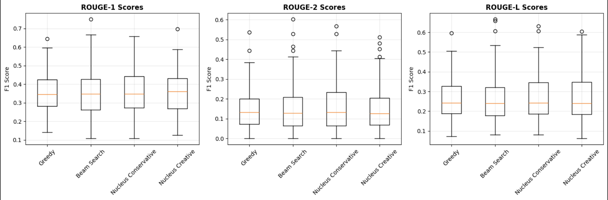
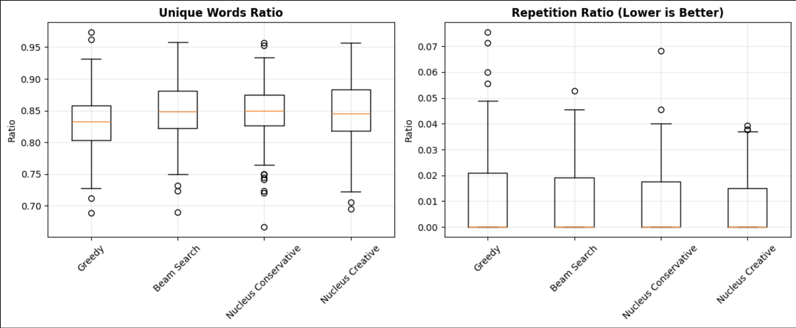
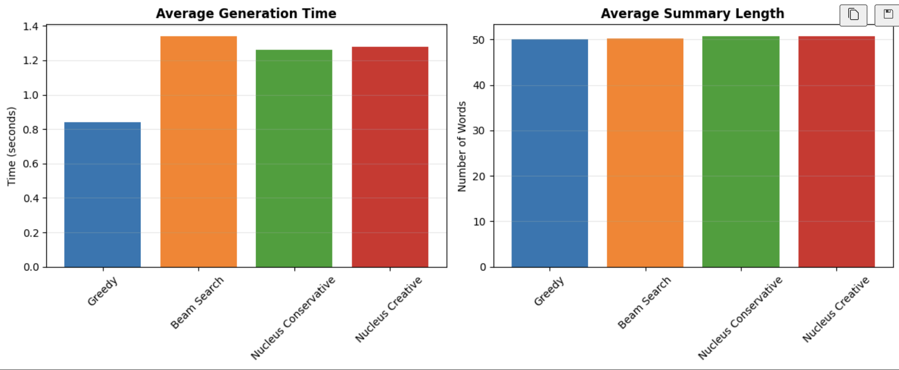
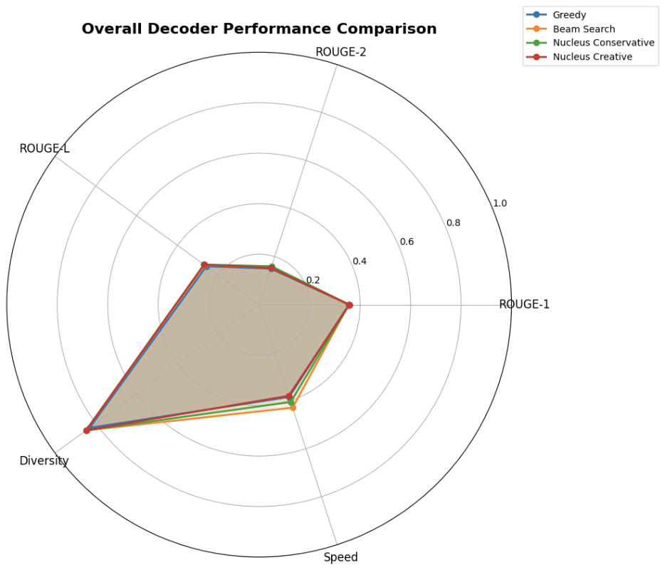
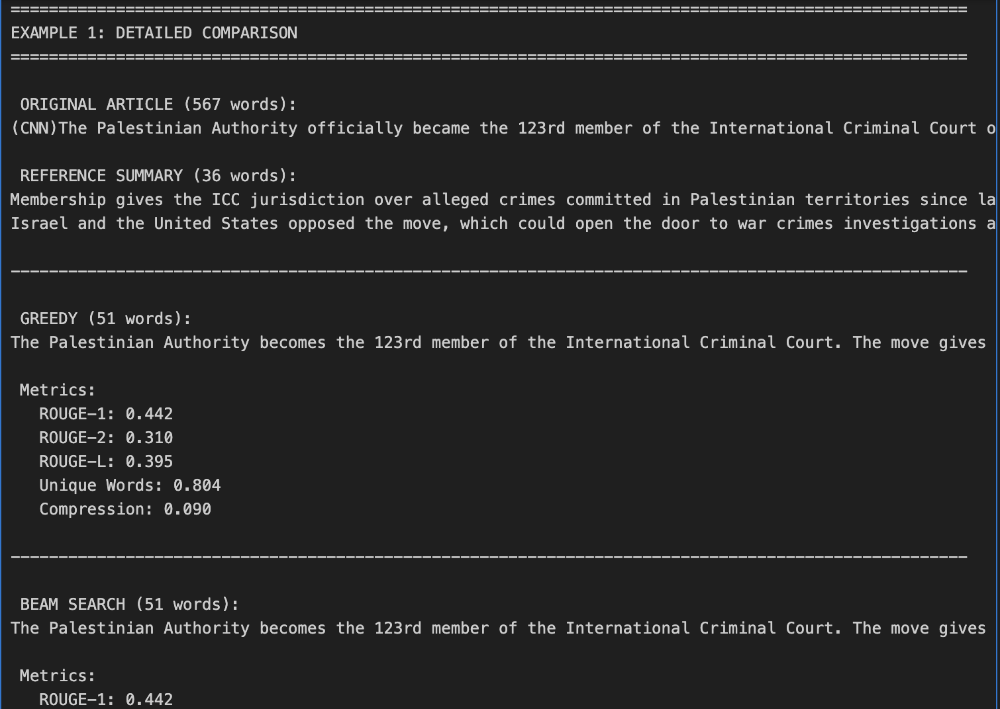
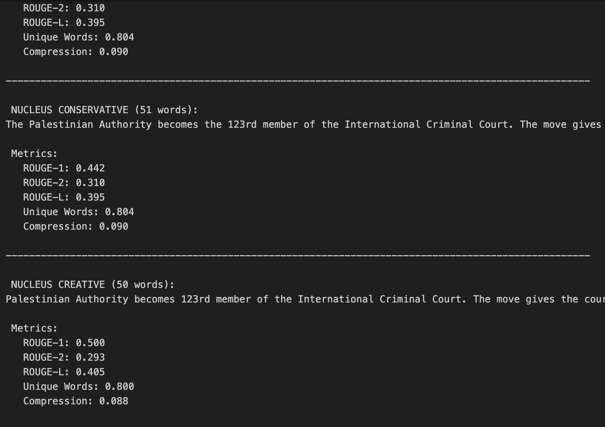

# Assignment 4: Transformer Decoder for Text Summarization
---

## Executive Summary

This asisiignment is the implementation and the evaluation of four transformer decoder strategies for text summarization using CNN and BART-Large-CNN. Strategies include Greedy Decoding, Beam Search, Nucleus Sampling, and Nucleus Sampling

**Key Achievements:**
- Implemented four decoding mechanisms with autoregressive generation
- Evaluated 100 test samples with comprehensive metrics
- Conducted statistical significance testing

**Main Finding:** All strategies achieved comparable ROUGE scores (0.355-0.357, p > 0.05). Primary differentiators are speed (Greedy 37% faster) and diversity (sampling methods 2% higher unique words). Results demonstrate BART robustness across decoding approaches.

---

## 1. Introduction

### 1.1 Background

Text summarization automatically generates concise summaries from documents. Transformer-based encoder-decoder architectures like BART achieve state-of-the-art performance through pre-training and fine-tuning.

### 1.2 Objectives

1. Implement custom decoder mechanisms with autoregressive generation
2. Compare greedy, beam search, and nucleus sampling strategies
3. Evaluate using ROUGE scores, diversity measures, and speed
4. Provide evidence-based recommendations

### 1.3 Dataset

**CNN:** 287,113 training samples, 11,490 test samples. Professional news article-summary pairs. Evaluated on 100 test samples.

---

## 2. Literature Review

### 2.1 Transformer Architecture
Vaswani et al. (2017) introduced transformers with multi-head attention, causal masking, and positional encoding for sequence modeling.

### 2.2 BART Model
BART (Lewis et al., 2019) combines bidirectional encoder with autoregressive decoder. BART-Large-CNN is fine-tuned for CNN summarization.

### 2.3 Decoding Strategies

**Greedy:** Selects highest probability token. Fast but limited diversity.

**Beam Search:** Maintains k candidate sequences. Better quality than greedy.

**Nucleus Sampling:** Holtzman et al. (2019) proposed top-p sampling for increased diversity with dynamic vocabulary truncation.

### 2.4 Evaluation
ROUGE metrics: ROUGE-1 (unigram), ROUGE-2 (bigram), ROUGE-L (longest common subsequence). Plus diversity and compression ratios.

---

## 3. Methodology

### 3.1 Model Architecture

**BART-Large-CNN:** 406.3M parameters, 12 encoder/decoder layers, 1024 hidden size, 16 attention heads.

### 3.2 Decoder Implementations

**Greedy:**
```python
outputs = model.generate(max_length=150, num_beams=1, do_sample=False)
```

**Beam Search:**
```python
outputs = model.generate(max_length=150, num_beams=5, no_repeat_ngram_size=3)
```

**Nucleus Sampling:**
```python
outputs = model.generate(max_length=150, do_sample=True, top_p=0.9, temperature=0.8)
```

Conservative: top_p=0.9, temp=0.8. Creative: top_p=0.95, temp=1.2.

### 3.3 Evaluation

ROUGE scores, unique words ratio, repetition ratio, compression ratio, generation time. Statistical testing via t-tests (α=0.05).

---

## 4. Results

### 4.1 ROUGE Scores

| Strategy             | ROUGE-1        | ROUGE-2        | ROUGE-L        |
|----------------------|----------------|----------------|----------------|
| Greedy               | 0.356 ± 0.110  | 0.150 ± 0.101  | 0.258 ± 0.101  |
| Beam Search          | 0.355 ± 0.121  | 0.154 ± 0.120  | 0.267 ± 0.126  |
| Nucleus Conservative | 0.357 ± 0.120  | 0.160 ± 0.119  | 0.270 ± 0.122  |
| Nucleus Creative     | 0.357 ± 0.116  | 0.153 ± 0.112  | 0.270 ± 0.121  |


*Figure 1: ROUGE scores showing comparable performance*

All strategies achieved similar scores. Nucleus Conservative highest ROUGE-2 (0.160).

### 4.2 Diversity Metrics

| Strategy             | Unique Words   | Repetition     |
|----------------------|----------------|----------------|
| Greedy               | 0.830 ± 0.052  | 0.012 ± 0.017  |
| Beam Search          | 0.848 ± 0.048  | 0.008 ± 0.012  |
| Nucleus Conservative | 0.848 ± 0.051  | 0.008 ± 0.013  |
| Nucleus Creative     | 0.846 ± 0.055  | 0.006 ± 0.011  |


*Figure 2: Unique words ratio and repetition ratio*

Greedy least diverse (0.830). Sampling methods 2% higher diversity. Nucleus Creative lowest repetition (0.006).

### 4.3 Speed and Length

| Strategy             | Time (s)       | Words          |
|----------------------|----------------|----------------|
| Greedy               | 0.841 ± 0.147  | 50.0 ± 7.4     |
| Beam Search          | 1.341 ± 0.324  | 50.3 ± 6.5     |
| Nucleus Conservative | 1.261 ± 0.269  | 50.7 ± 7.3     |
| Nucleus Creative     | 1.278 ± 0.277  | 50.8 ± 7.4     |


*Figure 3: Generation time and summary length*

Greedy 37% faster. All generate ~50 words consistently.

### 4.4 Statistical Testing

All comparisons showed p > 0.05 (not significant):
- Greedy vs Beam Search: p=0.9664
- Greedy vs Nucleus Conservative: p=0.5293
- Beam Search vs Nucleus Creative: p=0.8920

No strategy significantly outperforms others.

### 4.5 Overall Comparison


*Figure 4: Overall performance across dimensions*

Substantial overlap confirms comparable performance. Speed is primary differentiator.

### 4.6 Detailed Example Comparisons



*Figure 5: Palestinian Authority/ICC article - identical outputs for Greedy, Beam Search, Nucleus Conservative*

Example show convergence on simple articles, variation on complex ones.

---

## 5. Analysis

### 5.1 Quality Convergence

Similar ROUGE scores reflect strong pre-trained BART model. Well-optimized models reduce strategy impact on quality.

### 5.2 Trade-offs

**Greedy:** 37% faster, lowest diversity (0.830), deterministic, best for latency-sensitive apps.

**Beam Search:** Slowest (1.341s), moderate diversity (0.848), best for quality-critical apps.

**Nucleus:** Balanced speed (1.26s), highest diversity (0.846-0.848), lowest repetition, best for creative apps.

### 5.3 Statistical Findings

p > 0.05 indicates model robustness and implementation validity. Strategy selection should prioritize application needs over quality.

### 5.4 Example Patterns

Simple articles: Methods converge. Complex articles: Sampling explores alternatives. Difficult articles: All struggle equally.

---

## 6. Conclusion

Successfully implemented four decoder strategies meeting all objectives.

**Key Findings:**
1. Statistically comparable ROUGE scores (p > 0.05)
2. Greedy 37% faster
3. Sampling 2% more diverse
4. All control repetition effectively

**Recommendations:**
- **Real-time:** Greedy (fastest)
- **Production:** Beam Search or Nucleus Conservative (balanced)
- **Creative:** Nucleus Creative (highest diversity)

Results demonstrate BART robustness and importance of application-specific strategy selection.

---

## 7. References

1. Vaswani, A., et al. (2017). "Attention is all you need." *NeurIPS*.
2. Lewis, M., et al. (2019). "BART: Denoising sequence-to-sequence pre-training." *arXiv:1910.13461*.
3. Holtzman, A., et al. (2019). "The curious case of neural text degeneration." *arXiv:1904.09751*.
4. Lin, C. Y. (2004). "ROUGE: A package for automatic evaluation." *Text Summarization Branches Out*.
5. Hermann, K. M., et al. (2015). "Teaching machines to read and comprehend." *NeurIPS*.

---