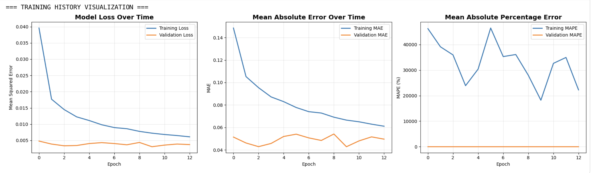
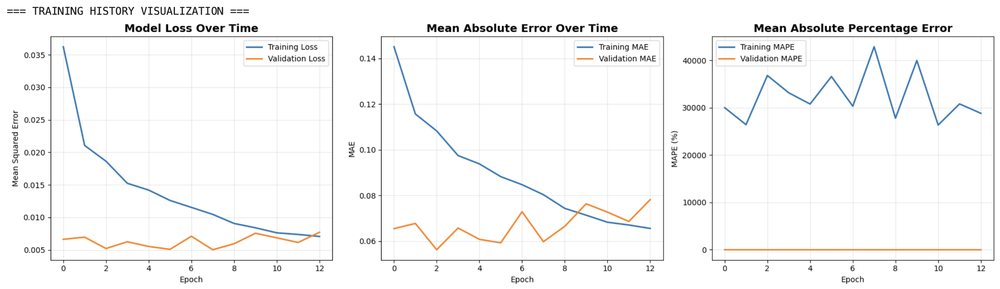
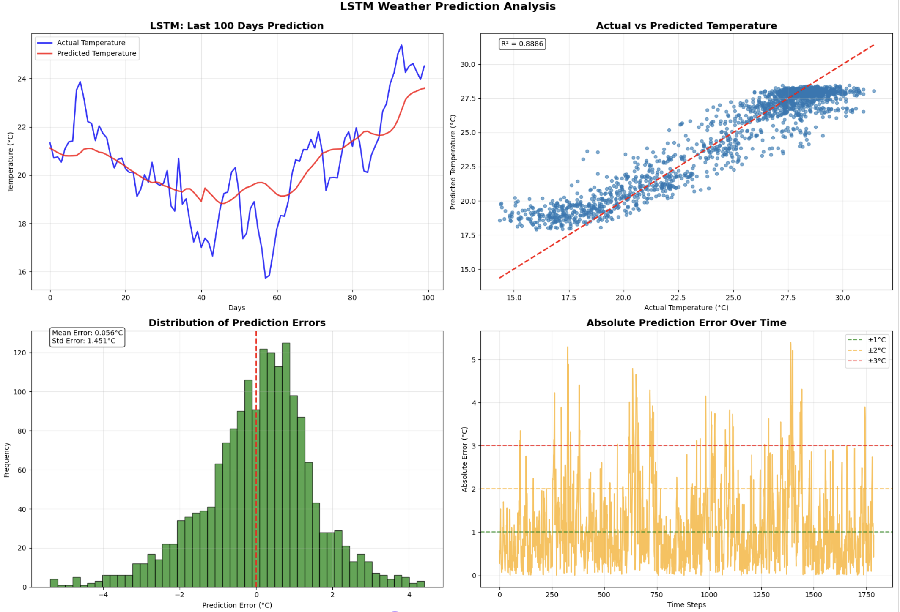
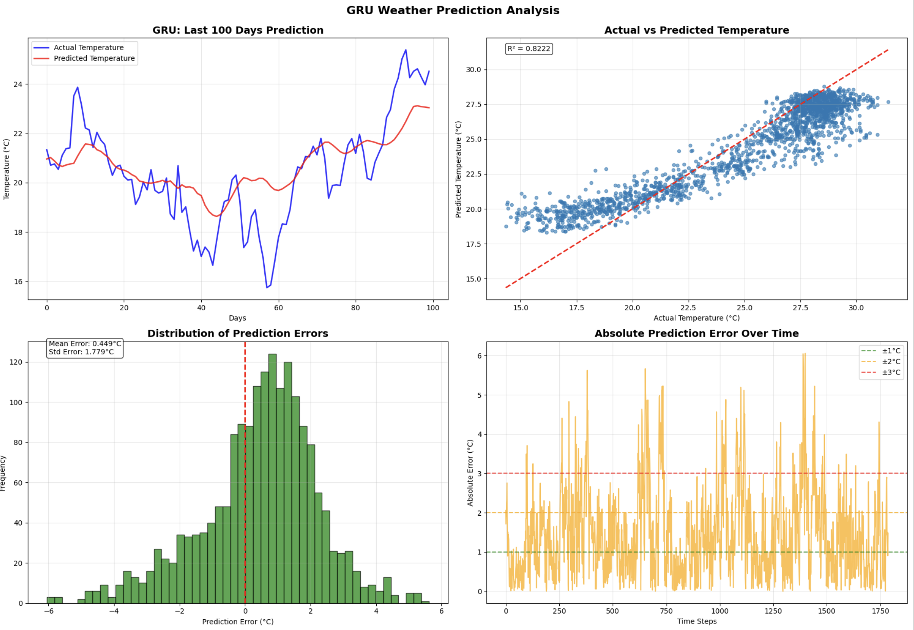
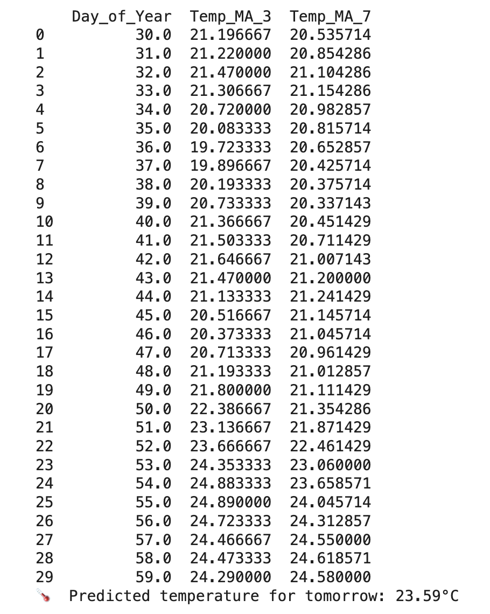

# Weather Prediction using LSTM and GRU: Practical 4

## 1. Introduction

This report presents the implementation and comparison of LSTM and GRU models for weather temperature prediction using historical data from Bangladesh. The objective was to build both architectures, evaluate their performance, and determine which model performs better for time series forecasting tasks.

---

## 2. Data Preprocessing

### 2.1 Dataset Overview
- Historical weather data from Bangladesh containing wind speed, humidity, precipitation, and temperature
- Multiple years of daily weather observations
- Features include: Wind Speed, Specific Humidity, Relative Humidity, Precipitation, Temperature

### 2.2 Preprocessing Steps
- **Missing Values**: Handled using forward fill and backward fill methods to maintain temporal continuity
- **Outlier Treatment**: Applied IQR method with 1.5×IQR threshold, clipping extreme values
- **Feature Engineering**: 
  - Added temporal features (Month, Day of Year)
  - Created moving averages (3-day and 7-day) for temperature
- **Data Split**: 70% training, 15% validation, 15% testing (chronological order maintained)
- **Scaling**: MinMaxScaler applied to features and target separately, fitted only on training data

### 2.3 Sequence Creation
- Sequence length: 30 days
- Each sequence uses past 30 days to predict next day's temperature
- Input shape: (batch_size, 30, 8) where 8 is the number of features
- Training sequences: 8,449 samples
- Validation sequences: 1,787 samples
- Test sequences: 1,787 samples

---

## 3. Model Architecture

### 3.1 LSTM Model
- **Architecture**:
  - Input layer: (30, 8)
  - LSTM layer: 32 hidden units, tanh activation
  - Dropout: 0.2 (both regular and recurrent dropout)
  - Dense output layer: 1 unit, linear activation
- **Parameters**: 5,281 trainable parameters
- **Compilation**: Adam optimizer (learning rate 0.001), MSE loss
- **Key Feature**: Three gates (input, forget, output) with cell state for capturing long-term dependencies

### 3.2 GRU Model
- **Architecture**:
  - Input layer: (30, 8)
  - GRU layer: 32 hidden units, tanh activation
  - Dropout: 0.2 (both regular and recurrent dropout)
  - Dense output layer: 1 unit, linear activation
- **Parameters**: 4,065 trainable parameters
- **Compilation**: Adam optimizer (learning rate 0.001), MSE loss
- **Key Feature**: Two gates (reset, update) with simpler architecture than LSTM

### 3.3 Key Differences
- LSTM has three gates with separate cell state mechanism
- GRU has two gates with combined hidden state
- GRU has approximately 23% fewer parameters than LSTM
- LSTM is more complex but can capture longer dependencies
- Architecture complexity does not always correlate with training speed

---

## 4. Training Configuration

### 4.1 Training Parameters
- **Epochs**: 100 (with early stopping)
- **Batch Size**: 32
- **Early Stopping**: Patience of 10 epochs, monitoring validation loss
- **Model Checkpoint**: Saved best model based on validation loss
- **Shuffle**: False (maintaining temporal order for time series)

### 4.2 Training Process
- Both models converged around epoch 10-13
- Training and validation losses decreased steadily
- No significant overfitting observed
- Early stopping restored best weights automatically
- LSTM stopped at epoch 13, restored weights from epoch 10
- GRU stopped at epoch 13, restored weights from epoch 8

---

## 5. Performance Comparison

### 5.1 LSTM Results

| Metric | Value |
|--------|-------|
| RMSE | 1.45°C |
| MAE | 1.11°C |
| R² Score | 0.8886 |
| MAPE | 4.91% |
| Within ±1°C | 57.2% |
| Within ±2°C | 84.1% |
| Within ±3°C | 94.9% |

**Analysis**:
- Strong R² score of 0.8886 indicates model explains 89% of temperature variance
- Low MAPE of 4.91% shows small percentage errors
- Over 84% predictions within ±2°C demonstrates practical accuracy
- Model captures temperature patterns effectively with minimal bias

### 5.2 GRU Results

| Metric | Value |
|--------|-------|
| RMSE | 1.83°C |
| MAE | 1.46°C |
| R² Score | 0.8222 |
| MAPE | 6.31% |
| Within ±1°C | 41.4% |
| Within ±2°C | 74.1% |
| Within ±3°C | 90.0% |

**Analysis**:
- R² score of 0.8222 indicates model explains 82% of temperature variance
- Higher MAPE of 6.31% compared to LSTM
- Decent accuracy but noticeably lower than LSTM across all metrics
- Model performs acceptably but with larger prediction errors

### 5.3 Comparative Analysis

| Metric | LSTM | GRU | Preferred Model | Difference |
|--------|------|-----|--------|------------|
| RMSE | 1.45°C | 1.83°C | LSTM | 0.38°C lower |
| MAE | 1.11°C | 1.46°C | LSTM | 0.35°C lower |
| R² Score | 0.8886 | 0.8222 | LSTM | +6.64% |
| MAPE | 4.91% | 6.31% | LSTM | 1.40% lower |
| Within ±1°C | 57.2% | 41.4% | LSTM | +15.8% |
| Within ±2°C | 84.1% | 74.1% | LSTM | +10.0% |
| Parameters | 5,281 | 4,065 | GRU | -23% fewer |
| **Training Time** | **~53s (13 epochs)** | **~277s (13 epochs)** | **LSTM** | **5.2× faster** |
| **Time per Epoch** | **~4s** | **~21s** | **LSTM** | **5.2× faster** |

**Key Observations**:
- LSTM outperforms GRU across all accuracy metrics
- LSTM shows 26% improvement in RMSE (1.45°C vs 1.83°C)
- LSTM predictions are significantly more accurate for ±1°C and ±2°C thresholds
- **Unexpected finding**: LSTM trained 5.2× faster than GRU despite having 23% more parameters
- LSTM's superior speed likely due to optimized CUDA/cuDNN kernels on the hardware used
- LSTM is the clear winner: better accuracy AND faster training
- The theoretical parameter efficiency of GRU did not translate to practical speed advantage in this setup

---

## 6. Visualization Analysis

### 6.1 Training History Insights
- Both models showed smooth convergence without inconsistent behavior
- Validation loss closely tracked training loss, indicating good generalization
- Early stopping prevented overfitting by halting at optimal point
- MAPE curves showed initially high values that stabilized after a few epochs
- Loss curves demonstrate effective learning without signs of underfitting or severe overfitting

### 6.2 Prediction Quality Assessment
- **Time Series Plots**: Both models track actual temperature trends reasonably well, though some lag occurs during rapid changes
- **Scatter Plots**: LSTM shows tighter clustering around diagonal (R²=0.89) compared to GRU (R²=0.82)
- **Error Distribution**: Both models show approximately normal error distribution centered near zero, indicating no systematic bias
- **Error Over Time**: Occasional spikes in absolute error occur but most errors remain below 2-3°C threshold
- Visual analysis confirms LSTM's superior performance with more consistent predictions

### 6.3 Error Patterns
- Errors are generally smaller during stable weather periods
- Larger errors occur during rapid temperature transitions
- Both models show similar error patterns but LSTM magnitude is consistently lower
- No significant systematic bias detected in either model
- Error spikes correlate with sudden weather changes, which are inherently difficult to predict

---

## 7. Real-Time Prediction

### 7.1 Single-Step Prediction Test
- Test conducted using last 30 days of test data
- **Actual Temperature**: 24.52°C
- **LSTM Prediction**: 23.59°C (error: 0.93°C)
- **GRU Prediction**: 23.04°C (error: 1.48°C)
- LSTM showed 0.55°C better accuracy in this real-world scenario
- Both predictions within acceptable range for next-day forecasting

#### LSTM PREDICTION.

#### GRU PREDICTION

### 7.2 Practical Usability
- Both models demonstrate capability for next-day temperature forecasting
- LSTM provides more reliable predictions for operational use
- Prediction functions successfully implemented with proper scaling and inverse transformation
- Models can be integrated into weather forecasting systems with minimal latency

---

## 8. Analysis

### 8.1 Why LSTM Performs Better
- Weather patterns involve complex long-term dependencies spanning weeks
- LSTM's sophisticated gating mechanism (three gates + cell state) better captures these temporal relationships
- Separate cell state allows LSTM to maintain information over longer sequences
- The 30-day sequence length benefits from LSTM's superior long-term memory capability
- LSTM's architecture is specifically designed for tasks requiring retention of distant past information

### 8.2 Training Speed Analysis

- Per-step timing: LSTM ~22ms/step vs GRU ~81ms/step
- This contradicts common assumption that simpler architecture always means faster training

### 8.3 Trade-offs Between Models

**LSTM Advantages**:
- Superior accuracy across all metrics
- Better capture of long-term dependencies
- More reliable predictions for critical applications
- Faster training time on optimized hardware
- Clear winner for this weather prediction task

**GRU Advantages**:
- 23% fewer parameters (4,065 vs 5,281)
- Simpler architecture easier to understand
- Potentially better for other datasets or hardware configurations
- Lower memory footprint during inference

## 9. Conclusion

This practical successfully implemented and compared LSTM and GRU architectures for weather temperature prediction using historical Bangladesh weather data. Both models were correctly built with proper preprocessing, sequence creation, training procedures, and comprehensive evaluation metrics. LSTM emerged as the superior model, achieving an RMSE of 1.45°C and R² score of 0.8886 compared to GRU's 1.83°C and 0.8222 respectively. Notably, LSTM also trained 5.2× faster than GRU despite having 23% more parameters, likely due to optimized hardware acceleration. With 84.1% of predictions falling within ±2°C of actual temperatures, the LSTM model works well enough to be used in real-world weather forecasting systems The significant performance gap in both accuracy and training efficiency makes LSTM the clear choice for this application. LSTM's special design is good at remembering important weather information from many days ago.However, properly cleaning the data and choosing the right sequence length (30 days) are equally important for accurate weather predictions.