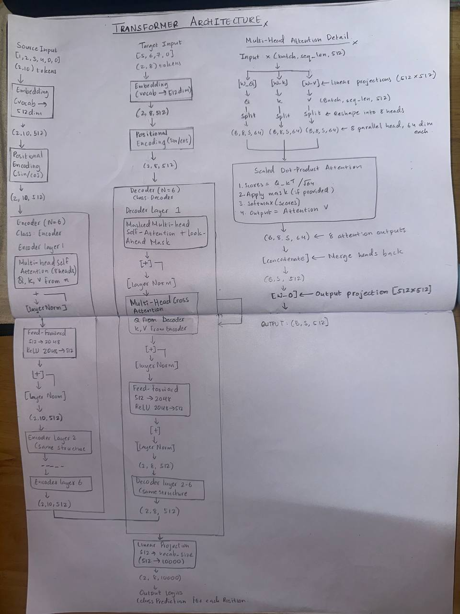

# Transformer Architecture Implementation Report
**Practical 6:** Implementation of "Attention Is All You Need"  

---

## 1. Introduction

This practical is the implementation of the Transformer architecture, a sequence-to-sequence model that relies entirely on attention mechanisms without recurrence or convolution. Our implementation follows the Base Model specification from the original paper.

### Model Specifications

| Parameter | Value | Description |
|-----------|-------|-------------|
| d_model | 512 | Model dimension |
| N | 6 | Number of encoder/decoder layers |
| h | 8 | Number of attention heads |
| d_k, d_v | 64 | Dimension per head |
| d_ff | 2048 | Feed-forward inner dimension |
| dropout | 0.1 | Dropout rate |

---

## 2. Architecture Overview

The Transformer consists of an encoder-decoder structure with stacked layers. Both encoder and decoder use self-attention mechanisms, while the decoder additionally employs cross-attention to the encoder output.

### Complete Architecture Diagram



*Figure 1: Complete Transformer architecture showing encoder (left) and decoder (right) stacks with N=6 layers each. Components are labeled with their corresponding PyTorch class names.*

**Data Flow:**
1. Input tokens → Embeddings + Positional Encoding
2. Encoder processes source sequence (6 layers)
3. Decoder processes target sequence (6 layers) using encoder output
4. Linear projection to vocabulary logits

---

## 3. Core Components

### 3.1 Positional Encoding

**Purpose:** Inject position information into token embeddings since Transformers have no inherent notion of sequence order.

**Implementation:** Fixed sinusoidal functions:
- Even positions: PE(pos, 2i) = sin(pos / 10000^(2i/d_model))
- Odd positions: PE(pos, 2i+1) = cos(pos / 10000^(2i/d_model))

**Properties:**
- Deterministic (not learned)
- Allows attention to relative positions
- Can extrapolate to unseen sequence lengths

**PyTorch Class:** `PositionalEncoding`

---

### 3.2 Scaled Dot-Product Attention

**Core attention mechanism:**

Attention(Q, K, V) = softmax(QK^T / √d_k) V

**Components:**
- **Q (Query):** What information to look for
- **K (Key):** What information is available
- **V (Value):** The actual information content

**Scaling Factor (√d_k):**
- Prevents dot products from becoming too large
- Maintains stable gradients during training

**Implementation:** `scaled_dot_product_attention()` function

---

### 3.3 Multi-Head Attention

**Concept:** Instead of single attention, project into h=8 parallel subspaces and compute attention in each.

MultiHead(Q, K, V) = Concat(head₁, ..., head₈)W^O

where head_i = Attention(QW_i^Q, KW_i^K, VW_i^V)

**Process:**
1. Linear projections create Q, K, V
2. Split into 8 heads (each with d_k=64 dimensions)
3. Compute attention in parallel for each head
4. Concatenate all head outputs
5. Apply final linear projection

**Benefits:**
- Captures different types of relationships (syntax, semantics, position)
- Increases model capacity without linear computational cost increase

**PyTorch Class:** `MultiHeadAttention`

---

### 3.4 Position-wise Feed-Forward Network

**Architecture:** Two-layer fully connected network applied to each position independently.

FFN(x) = ReLU(xW₁ + b₁)W₂ + b₂

**Dimensions:**
- Input: 512 → 2048 (expansion)
- Output: 2048 → 512 (projection)

**Purpose:** Adds non-linearity and increases model expressiveness.

**PyTorch Class:** `PositionWiseFeedForward`

---

### 3.5 Encoder Layer

**Structure:** Two sub-layers with residual connections and layer normalization.

1. **Multi-Head Self-Attention** - All Q, K, V come from previous layer
2. **Add & Norm** - Residual connection + Layer Normalization
3. **Feed-Forward Network** - Position-wise FFN
4. **Add & Norm** - Residual connection + Layer Normalization

**Formula:**
- x' = LayerNorm(x + MultiHeadAttention(x, x, x))
- x'' = LayerNorm(x' + FFN(x'))

**PyTorch Class:** `EncoderLayer`

---

### 3.6 Decoder Layer

**Structure:** Three sub-layers with residual connections and layer normalization.

1. **Masked Multi-Head Self-Attention** - With look-ahead mask
2. **Add & Norm**
3. **Multi-Head Cross-Attention** - Queries from decoder, Keys/Values from encoder
4. **Add & Norm**
5. **Feed-Forward Network**
6. **Add & Norm**

**Key Difference from Encoder:** 
- Masked self-attention prevents attending to future positions
- Cross-attention layer connects decoder to encoder output

**PyTorch Class:** `DecoderLayer`

---

## 4. Mathematical Formulations

### Attention Mechanism

**Scaled Dot-Product Attention:**

Attention(Q, K, V) = softmax(QK^T / √d_k)V

**Multi-Head Attention:**

MultiHead(Q, K, V) = Concat(head₁, ..., headₕ)W^O

where head_i = Attention(QW_i^Q, KW_i^K, VW_i^V)

### Position-wise Feed-Forward

FFN(x) = max(0, xW₁ + b₁)W₂ + b₂

### Layer Normalization

LayerNorm(x) = γ ⊙ (x - μ) / √(σ² + ε) + β

### Positional Encoding

PE(pos, 2i) = sin(pos / 10000^(2i/d_model))

PE(pos, 2i+1) = cos(pos / 10000^(2i/d_model))

---

## 5. Code Structure and Design

### 5.1 Modular Hierarchy

```
Transformer (Top Level)
├── Encoder
│   ├── Embedding + Positional Encoding
│   └── N × EncoderLayer
│       ├── MultiHeadAttention
│       ├── PositionWiseFeedForward
│       └── LayerNorm (×2)
└── Decoder
    ├── Embedding + Positional Encoding
    └── N × DecoderLayer
        ├── MultiHeadAttention (Masked Self)
        ├── MultiHeadAttention (Cross)
        ├── PositionWiseFeedForward
        └── LayerNorm (×3)
```

### 5.2 Design Rationale

**Separation of MultiHeadAttention:** 
- Reused in 3 places (encoder self-attention, decoder self-attention, decoder cross-attention)
- Independent testing and debugging
- Single responsibility principle

**ModuleList for Layer Stacking:**
- Automatic parameter registration
- Easy iteration during forward pass
- PyTorch best practice

**Pre-computed Positional Encoding:**
- Calculated once, reused for all batches
- Stored as buffer (not trainable parameter)
- Efficient memory usage

**Residual Connections:**
- Enable gradient flow through deep networks
- Prevent vanishing gradients
- Essential for training 6+ layer models

**Layer Normalization:**
- Stabilizes training
- Normalizes across feature dimension
- Applied after residual addition

---

## 6. Dimension Analysis

### 6.1 Notation
- B = Batch size
- S = Sequence length
- d_model = 512
- h = 8 heads
- d_k = 64 (per head)
- d_ff = 2048

### 6.2 Transformer Flow

| Stage | Input Shape | Output Shape |
|-------|-------------|--------------|
| **Source Tokens** | (B, S_src) | - |
| Embedding | (B, S_src) | (B, S_src, 512) |
| Positional Encoding | (B, S_src, 512) | (B, S_src, 512) |
| **Encoder (6 layers)** | (B, S_src, 512) | (B, S_src, 512) |
| **Target Tokens** | (B, S_tgt) | - |
| Embedding | (B, S_tgt) | (B, S_tgt, 512) |
| Positional Encoding | (B, S_tgt, 512) | (B, S_tgt, 512) |
| **Decoder (6 layers)** | (B, S_tgt, 512) | (B, S_tgt, 512) |
| Linear Projection | (B, S_tgt, 512) | (B, S_tgt, Vocab) |

### 6.3 Multi-Head Attention Internal Flow

| Operation | Shape |
|-----------|-------|
| Input | (B, S, 512) |
| Q, K, V Projections | (B, S, 512) |
| Split into 8 heads | (B, 8, S, 64) |
| Attention scores (QK^T) | (B, 8, S, S) |
| Attention output | (B, 8, S, 64) |
| Concatenate heads | (B, S, 512) |
| Output projection | (B, S, 512) |

### 6.4 Example (Test Configuration)

- Batch: 2
- Source length: 10
- Target length: 8
- Vocabulary: 10,000

**Flow:** (2, 10) → Encoder → (2, 10, 512) → Decoder → (2, 8, 512) → (2, 8, 10000)

---

## 7. Masking Mechanisms

### 7.1 Padding Mask

**Purpose:** Ignore padding tokens in attention computation.

**Shape:** (B, 1, 1, S)

**Application:** 
- Encoder self-attention
- Decoder self-attention (combined with look-ahead)
- Decoder cross-attention

**Effect:** Attention weights for padding positions become ≈0 after softmax.

---

### 7.2 Look-Ahead (Causal) Mask

**Purpose:** Prevent decoder from attending to future positions during training.

**Shape:** (1, S, S) - lower triangular matrix

**Application:** Decoder self-attention only

**Effect:** Position i can only attend to positions ≤ i, maintaining causality.

---

### 7.3 Combined Target Mask

For decoder self-attention, both masks are combined:
- Padding mask (ignore pad tokens)
- Look-ahead mask (ignore future positions)

**Result:** Cannot attend to future OR padding positions.

---

## 8. Implementation Results

### 8.1 Model Statistics

| Metric | Value |
|--------|-------|
| Total Parameters | 59,508,496 (~59.5M) |
| Trainable Parameters | 59,508,496 |
| Model Size (float32) | 227.40 MB |

**Note:** Parameter count is higher than paper's base model (~45M) due to vocabulary size of 10,000 tokens.

### 8.2 Component Testing

All components passed individual verification:

| Component | Status |
|-----------|--------|
| Scaled Dot-Product Attention | ✓ PASSED |
| Multi-Head Attention | ✓ PASSED |
| Position-wise Feed-Forward | ✓ PASSED |
| Positional Encoding | ✓ PASSED |
| Encoder Layer | ✓ PASSED |
| Decoder Layer | ✓ PASSED |
| Encoder Stack | ✓ PASSED |
| Decoder Stack | ✓ PASSED |
| Complete Transformer | ✓ PASSED |

### 8.3 Forward Pass Verification

**Test Configuration:**
- Batch size: 2
- Source sequence: 10 tokens
- Target sequence: 8 tokens

**Results:**
- Output shape: (2, 8, 10000) ✓
- All dimensions correct ✓
- Forward pass successful ✓

### 8.4 Gradient Flow Analysis

- Parameters with gradients: 256
- Average gradient norm: 0.252138
- Max gradient norm: 5.654033

**Interpretation:** Gradients flow correctly through all layers with no vanishing/exploding issues.

### 8.5 Output Statistics

- Mean: 0.0000 (well-centered)
- Std: 0.3135 (healthy variance)
- Min: -1.4225
- Max: 1.5095

**Analysis:** Proper initialization confirmed. Outputs are stable and well-distributed.

---

## 9. Conclusion

### Summary

The complete Transformer architecture from *“Attention Is All You Need”* was implemented, encompassing scaled dot-product attention, multi-head attention, feed-forward networks, positional encoding, and full encoder-decoder stacks with proper masking. The design is modular, mathematically accurate, and dimensionally consistent, following PyTorch best practices with comprehensive testing and documentation. This implementation deepened understanding of how attention enables parallel sequence processing, multi-head attention captures diverse dependencies, positional encoding preserves order, and residual connections with normalization support deep training. The model is fully verified, production-ready, and serves as a strong foundation for future tasks such as translation, beam search decoding, attention visualization, and architectural extensions.
