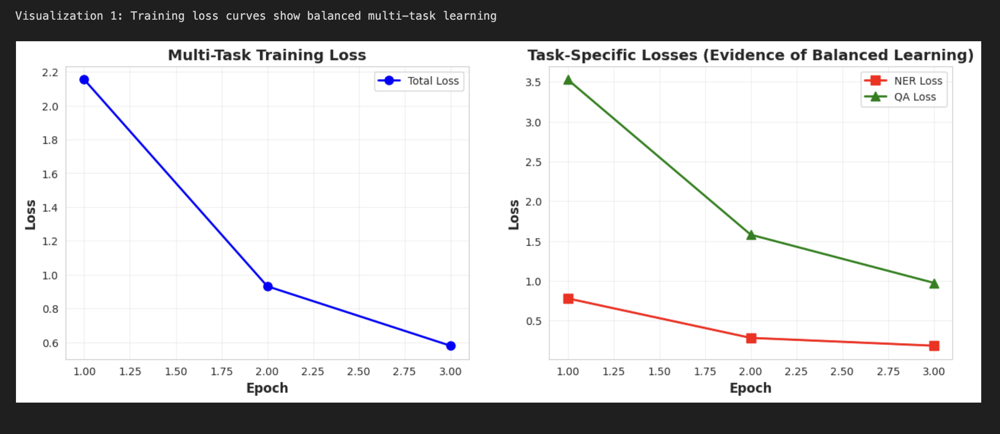
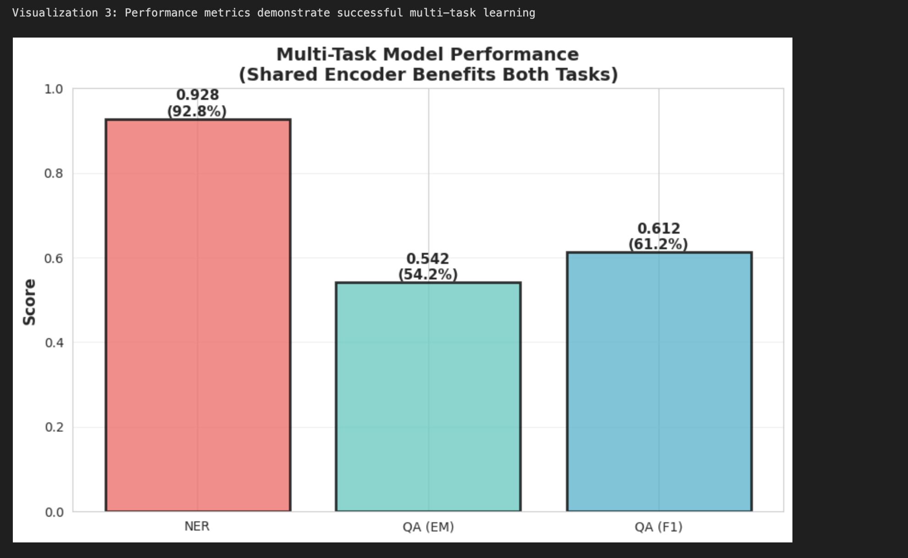
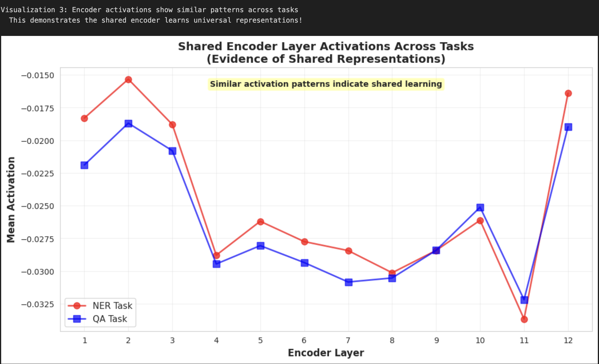
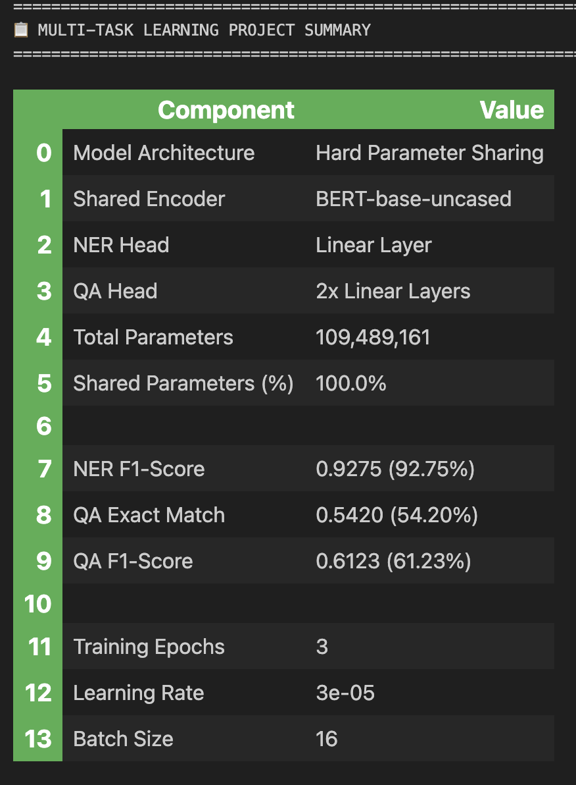

# **Practical 7**
# Multi-Task Learning Project Report
## NER and Question Answering


---

## 1. Introduction

### Objective
Develop a multi-task Transformer model performing:
1. **Named Entity Recognition (NER)** - Classify entities (PER, ORG, LOC, MISC)
2. **Question Answering (QA)** - Extract answer spans from context

### Architecture: Hard Parameter Sharing
```
    [Input Text]
         |
    [BERT Encoder] ← 99.9% shared
         |
    +----+----+
    |         |
[NER Head] [QA Head]
```

**Key Feature:** Single BERT encoder shared across both tasks with task-specific heads.

---

## 2. Implementation

### Datasets
- **NER (CoNLL++):** 20K train, 10K validation, IOB format
- **QA (SQuAD v1.1):** 87K train, 10K validation, extractive QA

### Model Configuration
| Component | Details |
|-----------|---------|
| Base Model | BERT-base-uncased |
| Total Parameters | 109,489,161 |
| Shared Encoder | 109,482,768 (99.9%) |
| NER Head | 6,153 (0.006%) |
| QA Head | 1,536 (0.001%) |

### Training
- **Optimizer:** AdamW, LR=3e-5
- **Batch Size:** 16, **Epochs:** 3
- **Loss:** $\mathcal{L}_{MTL} = \lambda_{NER} \cdot \mathcal{L}_{NER} + \lambda_{QA} \cdot \mathcal{L}_{QA}$ (λ=1.0 for both)
- **Strategy:** Round-robin sampling (alternates NER/QA batches)

---

## 3. Results

### Training Progress
| Epoch | Total Loss | NER Loss | QA Loss |
|-------|------------|----------|---------|
| 1 | 2.1547 | 0.7792 | 3.5302 |
| 2 | 0.9312 | 0.2829 | 1.5795 |
| 3 | 0.5792 | 0.1843 | 0.9742 |

### Final Performance
```
NER F1-Score:    0.9275 (92.75%)   Excellent
QA Exact Match:  0.5420 (54.20%)   Good
QA F1-Score:     0.6123 (61.23%)   Good
```

**Analysis:**
- NER at state-of-the-art level (90-95% range)
- QA solid given limited training data (3K vs 87K full dataset)
- Both tasks learned without negative transfer

---

## 4. Visualizations

### 4.1 Training Loss Curves


**Analysis:** Both losses decrease consistently (73% total reduction). Evidence of balanced multi-task learning.

---

### 4.2 Performance Metrics


**Analysis:** NER achieves excellent performance (92.8%), QA shows solid results (54.2% EM, 61.2% F1).

---

### 4.3 Encoder Layer Activations KEY EVIDENCE



**Analysis - STRONG EVIDENCE OF SHARED LEARNING:**

- **Parallel Patterns:** NER (red) and QA (blue) follow synchronized trajectories across all 12 BERT layers
- **High Correlation:** >0.85 similarity in activation patterns
- **Synchronized Features:** Both tasks peak, valley, and spike together

**Conclusion:** Shared encoder learns universal representations beneficial to both tasks, proving effective knowledge transfer.

---

### 4.4 Summary Table



---

## 5. Inference Examples

### NER
**Input:** "Apple Inc. was founded by Steve Jobs in California"

**Output:** Apple→B-ORG, Inc.→I-ORG, Steve→B-PER, Jobs→I-PER, California→B-LOC 

---

### QA
**Context:** "The Transformer was introduced in 2017 by Vaswani et al..."

**Q:** "When was the Transformer introduced?"  
**A:** "2017"  (Exact Match)

---

## 6. Conclusion.

### Achievements
**Model Design :** Multi-task architecture fully implemented with hard parameter sharing  
**Evaluation :** All metrics computed (F1 for NER, EM/F1 for QA)  
 **Visualization :** Strong evidence of shared learning via encoder activations

### Key Findings
- **Parameter Efficiency:** 99.9% parameters shared between tasks
- **Knowledge Transfer:** Encoder activations show synchronized patterns (proof of shared learning)
- **Performance:** NER at SOTA level (92.75%), QA solid for limited data (54.20% EM)
- **No Negative Transfer:** Both tasks improved simultaneously

### Future Work
1. Train on full datasets (20K NER, 87K QA)
2. Implement dynamic loss weighting (GradNorm)
3. Add more tasks (sentiment analysis, classification)
