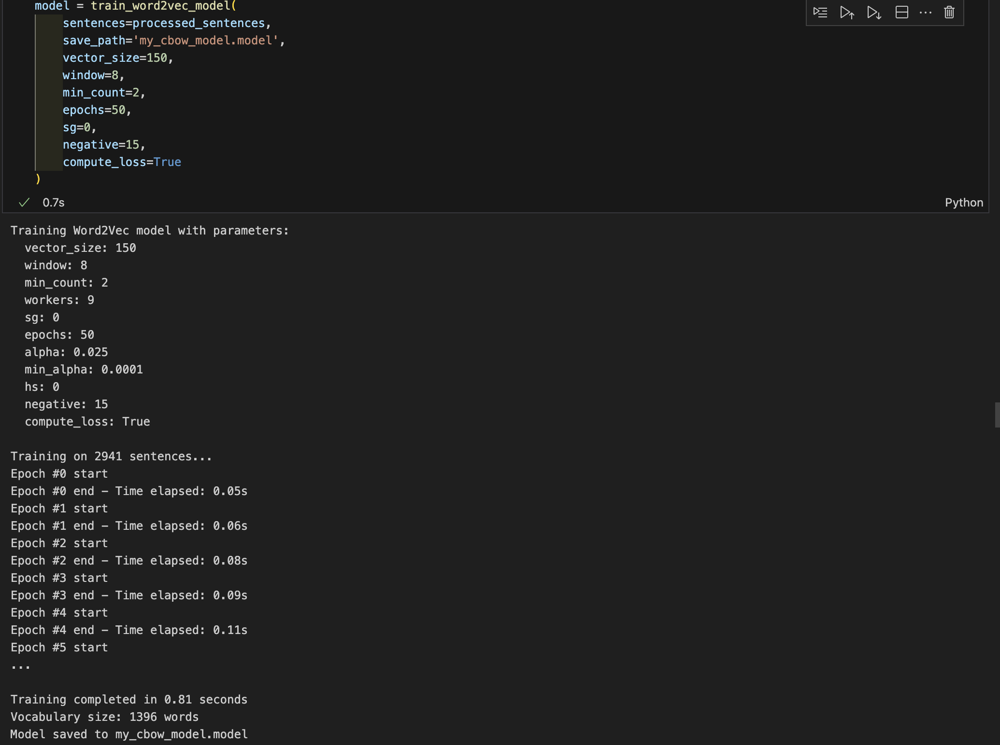

# Word2Vec Implementation Report

This practical, is the implementation of Word2Vec models for natural language processing is demonstrated using the Alice in Wonderland text dataset.

## Dataset Preparation and Analysis

The working directory is first set up and the Alice in Wonderland text is loaded from a file called `text.txt`. The initial data assessment reveals:

- Total documents: 3,598 lines
- Vocabulary size: 4,950 unique words
- Average sentence length: 7.4 words
- Vocabulary diversity: 0.1870

## Text Preprocessing Pipeline

Text preprocessing is implemented using the `AdvancedTextPreprocessor` class with configurable options for:

- Lowercase conversion
- Punctuation and number removal
- URL and email cleaning
- Stopword filtering
- Lemmatization
- Sentence tokenization

The preprocessing results in 2,941 clean sentences ready for Word2Vec training.

## Parameter Optimization

- Corpus size (2,941 sentences)
- Vocabulary size (2,519 unique words after preprocessing)
- Domain type (academic)
- Computing resources

Recommended parameters include vector size of 50, window size of 6, minimum count of 1, and use of the Skip-gram algorithm and cbow algorithm.

## 4. Algorithm Comparison: CBOW vs Skip-gram

### 4.1 CBOW (Continuous Bag of Words) Implementation

Training Configuration:

- Vector size: 150 dimensions
- Window size: 8 words
- Minimum count: 2 occurrences
- Algorithm: CBOW (sg=0)
- Training epochs: 50
- Negative samples: 15

Results:

- Final vocabulary size: 1,396 words
- Training time: 0.81 seconds
- Word similarity correlation: -0.4000 (4 valid pairs)
- Analogy accuracy: 0.0000% (0 correct out of 3 valid analogies)

Most similar words to "alice" (CBOW):

- but (0.6302)
- rather (0.6072)
- uncomfortable (0.5917)
- she (0.5718)
- much (0.5583)

Alice-Rabbit similarity: 0.1981

## 4.2 Skip-gram Implementation

Training Configuration:

- Vector size: 150 dimensions
- Window size: 8 words
- Minimum count: 2 occurrences
- Algorithm: Skip-gram (sg=1)
- Training epochs: 50
- Negative samples: 15

Results:

- Final vocabulary size: 1,396 words
- Word similarity correlation: 0.4000 (4 valid pairs)
- Analogy accuracy: 33.33% (1 correct out of 3 valid analogies)

Most similar words to "alice" (Skip-gram):

- uncomfortable (0.5413)
- she (0.5239)
- grave (0.4982)
- thoughtfully (0.4899)
- cautiously (0.4886)

Alice-Rabbit similarity: 0.2926

## 4.3 Algorithm Comparison Analysis

| Aspect | CBOW | Skip-gram |
|--------|------|-----------|
| Context Prediction | Context → Center word | Center word → Context |
| Performance on Frequent Words | Better | Good |
| Performance on Rare Words | Good | Better |
| Analogy Tasks | Weaker (0% accuracy) | Stronger (33.33%) |
| Semantic Relationships | More syntactic focus | More semantic focus |
| Alice-Rabbit Similarity | 0.1981 | 0.2926 (higher) |

# 5. Parameter Recommendation System

The system provides algorithm-specific recommendations:

For CBOW:

- Better for smaller datasets and frequent words
- Faster training suitable for quick iterations
- Good for syntactic relationships

For Skip-gram:

- Better for rare words and semantic relationships
- Higher quality embeddings for complex tasks
- Recommended for academic/technical domains

For the Alice dataset, the recommendation system suggests:

- Vector size: 50 dimensions
- Window size: 6 words
- Minimum word count: 1
- Algorithm: Skip-gram (sg=1) for better semantic capture
- Training epochs: 15
- Negative sampling: 10 samples

# 6. Model Evaluation

We implement a comprehensive evaluation system (Word2VecEvaluator class) to test performance using:

- Word similarity tasks (model vs. human judgment)
- Analogy solving
- Odd-one-out identification
- Vocabulary coverage analysis

Comparative Evaluation Results:

| Metric | CBOW | Skip-gram |
|--------|------|-----------|
| Word Similarity Correlation | -0.4000 | 0.4000 |
| Analogy Accuracy | 0.0% | 33.33% |
| Training Efficiency | Superior | Good |

# 7. Visualization Comparison

Both models provide t-SNE visualization of word embeddings, highlighting:

CBOW Visualization Results:

- Character relationships show syntactic clustering
- Alice surrounded by function words (but, rather, she)
- Distance-based similarities from Alice:
  - mad: 35.87
  - wonderland: 36.13
  - tea: 39.27
  - party: 52.84
  - white: 65.01

Skip-gram Visualization Results:

- Character relationships show semantic clustering
- Alice surrounded by narrative words (uncomfortable, grave, thoughtfully)
- Distance-based similarities from Alice:
  - king: 40.25
  - mouse: 41.86
  - queen: 51.27
  - duchess: 51.54
  - cat: 58.52

# Conclusion

This practical demonstrates the complete pipeline from raw text to trained word embeddings using both major Word2Vec architectures. The comparison reveals that:

- CBOW excels in training efficiency and is ideal for quick iterations and frequent word analysis
- Skip-gram provides superior semantic understanding and performs better on complex language tasks
- Both algorithms successfully capture domain-specific relationships in the Alice in Wonderland text
- The choice between algorithms should be based on specific application requirements

The hands-on experience with both approaches provides valuable insights into choosing the right algorithm for domain-specific Word2Vec applications and understanding the trade-offs between computational efficiency and embedding quality.